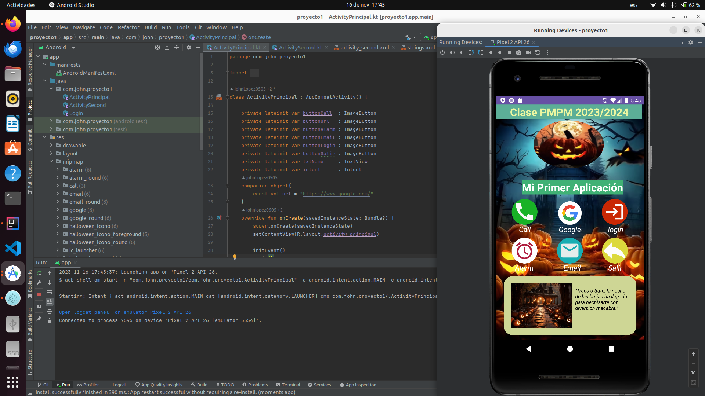

# Explicación de la APP

___

# ActivityPrincipal

La clase `ActivityPrincipal` es la actividad principal, actúa como la pantalla principal de la aplicación. Aquí se 
definen varios elementos de interfaz de usuario y se gestionan eventos para realizar acciones específicas. A
continuación, se explica el funcionamiento de esta clase:


```kotlin
class ActivityPrincipal : AppCompatActivity() {

   private lateinit var buttonCall  : ImageButton
   private lateinit var buttonUrl   : ImageButton
   private lateinit var buttonAlarm : ImageButton
   private lateinit var buttonEmail : ImageButton
   private lateinit var buttonLogin : ImageButton
   private lateinit var buttonSalir : ImageButton
   private lateinit var txtName     : TextView
   private lateinit var intent      : Intent
   companion object{
      const val url = "https://www.google.com/"
   }
   override fun onCreate(savedInstanceState: Bundle?) {
      super.onCreate(savedInstanceState)
      setContentView(R.layout.activity_principal)

      initEvent()
      login()
   }

   private fun login() {
      txtName = findViewById(R.id.txt_input_login)
      val name = getIntent().getStringExtra("name")
      if (name!= null){
         txtName.text = "$name"
      }
   }

   private fun initEvent() {
      buttonCall  = findViewById(R.id.btn_call)
      buttonUrl   = findViewById(R.id.btn_url)
      buttonAlarm = findViewById(R.id.btn_alarma)
      buttonEmail = findViewById(R.id.btn_email)
      buttonLogin = findViewById(R.id.btn_login)
      buttonSalir = findViewById(R.id.btn_salir)
      val message = "despertar"
      val hour = 7
      val minutes = 30

      buttonCall.setOnClickListener {
         intent = Intent(this, ActivitySecond::class.java).apply {
            putExtra("name", "LLamada de Emergencia")
         }
         startActivity(intent)
      }

      buttonLogin.setOnClickListener{
         intent = Intent(this,Login::class.java)
         Toast.makeText(this, "Abriendo ventana login", Toast.LENGTH_SHORT).show()
         startActivity(intent)
      }


      buttonSalir.setOnClickListener{
         // Mostrar un mensaje Toast indicando que la aplicación se cerrará
         Toast.makeText(this, "Cerrando la aplicación", Toast.LENGTH_SHORT).show()
         // Cerrar la actividad actual
         finish()
      }


      buttonUrl.setOnClickListener{
         intent = Intent(Intent.ACTION_VIEW).apply {
            data = Uri.parse(url)
         }
         startActivity(intent)
      }

      buttonAlarm.setOnClickListener{
         intent = Intent(AlarmClock.ACTION_SET_ALARM).apply{
            putExtra(AlarmClock.EXTRA_MESSAGE,message)
            putExtra(AlarmClock.EXTRA_HOUR,hour)
            putExtra(AlarmClock.EXTRA_MINUTES,minutes)
         }
         startActivity(intent)
      }


      val subject = "saludo"
      val content = "Hola clase PMP 23/24 "
      buttonEmail.setOnClickListener{
         intent = Intent(Intent.ACTION_SENDTO, Uri.fromParts("mailto","clase2Dam@educand.es",
            null)).apply {
            putExtra(Intent.EXTRA_SUBJECT,subject)
            putExtra(Intent.EXTRA_TEXT,content)
         }
         startActivity(intent)
      }

   }

}
```

## Atributos y Propiedades

**Botones de tipo `ImagenButton`**:
que representan acciones como llamada, abrir URL, configurar alarma, enviar correo electrónico, iniciar sesión y
salir, respectivamente.
- `buttonCall` : Al presionar el botón se inicia la ActivitySecond y se le pasa el mensaje "Llamada de Emergencia" como
   un dato adicional. 
- `buttonUrl`  : Al presionar el botón se abrirá una actividad que puede manejar la visualización de la URL especificada
   (en este caso, "https://www.google.com/").
- `buttonAlarm`: Al presionar el botón se abrirá la interfaz de configuración de alarma del sistema con la información 
   de la alarma previamente configurada mediante los extras del intent.
- `buttonEmail`: Al presionar el botón se abrirá una aplicación de correo electrónico (si está disponible en el 
   dispositivo) con la dirección de destino, el asunto y el contenido predefinidos para facilitar la redacción y envío 
   de un correo electrónico.
- `buttonLogin`: Al presionar el botón se abrila la actividad login donde nos pedira usuario y contraseña.
- `buttonSalir`: Al presionar el botón se mostrará un mensaje y se cerrará la actividad actual.
- `txtName`: TextView para mostrar el nombre del usuario.
- `intent`: Objeto de tipo `Intent` para manejar las transiciones entre actividades.
- `companion object`: Objeto compañero que contiene una constante `url` que representa la URL de Google.

## Métodos

### `onCreate()`

- Método de ciclo de vida de la actividad.
- Inicializa la interfaz de usuario y eventos al llamar a `initEvent()` y `login()`.

### `login()`

- Asigna el nombre del usuario extraído de la intención a `txtName` si está presente.

### `initEvent()`

- Inicializa los eventos de clic para cada botón.
- Abre la `ActivitySecond` al hacer clic en `buttonCall`.
- Abre la actividad de inicio de sesión (`Login`) al hacer clic en `buttonLogin`.
- Cierra la aplicación al hacer clic en `buttonSalir`.
- Abre una URL específica al hacer clic en `buttonUrl`.
- Configura una alarma al hacer clic en `buttonAlarm`.
- Abre una aplicación de correo electrónico con información predefinida al hacer clic en `buttonEmail`.

___

# ActivitySecond

La clase `ActivitySecond` es otra actividad de la aplicación que se inicia cuando se hace clic en el botón de llamada 
en la actividad principal. Esta actividad se encarga de mostrar el nombre del contacto al que se va a
llamar y permite al usuario realizar la llamada. A continuación, se explica el funcionamiento de esta clase:


```kotlin
class ActivitySecond : AppCompatActivity() {
   private lateinit var buttonCall2: ImageButton
   private lateinit var txtName: TextView
   companion object{
      const val PHONE = "623260768"
   }

   override fun onCreate(savedInstanceState: Bundle?) {
      super.onCreate(savedInstanceState)
      setContentView(R.layout.activity_secund)
      initEvent()
      showData()
   }

   private fun showData() {
      txtName = findViewById(R.id.marcar)
      val name = intent.getStringExtra("name")
      txtName.text = name
      Toast.makeText(this, "Datos mostrados con éxito", Toast.LENGTH_LONG).show()
   }

   private fun initEvent() {
      buttonCall2 = findViewById(R.id.btn_llamar)
      buttonCall2.setOnClickListener {
         requestPermissions()
      }
   }

   private fun requestPermissions() {
      if (Build.VERSION. SDK_INT >= Build.VERSION_CODES. M){
         if (permissionPhone()){
            call()
         }
         else{
            requestPermissionLauncher.launch(Manifest.permission.CALL_PHONE)
         }
      }else{
         call()
      }
   }

   private fun call() {
      val intent = Intent(Intent. ACTION_CALL).apply {
         data = Uri.parse( "tel:$PHONE")
      }
      startActivity(intent)
   }


   private fun permissionPhone(): Boolean = ContextCompat.checkSelfPermission( this,
      Manifest.permission.CALL_PHONE) == PackageManager. PERMISSION_GRANTED


   private val requestPermissionLauncher = registerForActivityResult(ActivityResultContracts.
   RequestPermission()) {  isGranted ->
      if (isGranted) {
         call()
      } else {
         Toast.makeText(
            this, "Necesitas habilitar los permisos", Toast.LENGTH_LONG).show()
      }
   }
}


```

## Atributos y Propiedades

- `buttonCall2`: Botón de tipo `ImageButton` para realizar una llamada.
- `txtName`: TextView para mostrar el nombre de la acción.
- `PHONE`: Número de teléfono constante para la llamada.

## Métodos

### `onCreate()`

- Método de ciclo de vida de la actividad.
- Inicializa la interfaz de usuario y eventos al llamar a `initEvent()` y `showData()`.

### `showData()`

- Muestra el nombre de la acción en `txtName`.

### `initEvent()`

- Inicializa el evento de clic para `buttonCall2`.
- Solicita permisos y realiza una llamada telefónica al hacer clic en `buttonCall2`.

### `requestPermissions()`

- Comprueba y solicita permisos para realizar una llamada telefónica.

### `call()`

- Inicia una llamada telefónica al número especificado en `PHONE`.

### `permissionPhone()`

- Verifica si los permisos de llamada telefónica están concedidos.

### `requestPermissionLauncher()`

- Maneja la respuesta de la solicitud de permisos y realiza una llamada si se conceden.

___

# Login

La clase `Login` es una actividad de inicio de sesión que permite a los usuarios ingresar con un nombre de usuario y 
una contraseña.

```kotlin
class Login : AppCompatActivity() {
    private lateinit var editTextUsername: EditText
    private lateinit var editTextPassword: EditText
    private lateinit var buttonRegistrar : Button
    private lateinit var buttonLogin     : Button
    companion object{
        const val MYUSER = "john" // tu usuario
        const val MYPASS = "1234" // tu contraseña
    }
    override fun onCreate(savedInstanceState: Bundle?) {
        super.onCreate(savedInstanceState)
        setContentView(R.layout.activity_login)
        
        initEvent()
    }

    private fun initEvent() {
        editTextUsername = findViewById(R.id.editTextUsername)
        editTextPassword = findViewById(R.id.editTextPassword)
        buttonRegistrar  = findViewById(R.id.button_registrar)
        buttonLogin      = findViewById(R.id.buttonLogin)
        
        buttonLogin.setOnClickListener {
            validarCredenciales()
        }
    }

    private fun validarCredenciales() {
        val user     = editTextUsername.text.toString()
        val password = editTextPassword.text.toString()
        
        if (user == MYUSER && password == MYPASS) {
            // Credenciales válidas, iniciar Activity principal
            val intent = Intent(this, ActivityPrincipal::class.java).apply {
                putExtra("name", "Bienvenido: $user")  // Pasamos el usuario como argumento al
                // Activity principal
            }
            startActivity(intent)
        } else {
            // Credenciales no válidas, mostrar Toast
            Toast.makeText(this, "Credenciales incorrectas", Toast.LENGTH_SHORT).show()
        }
    }
}
```

## Atributos y Propiedades

- `editTextUsername`: EditText - Campo de texto para el nombre de usuario. 
- `editTextPassword`: EditText - Campo de texto para la contraseña. 
- `buttonRegistrar` : Button - Botón para el registro de usuarios. 
- `buttonLogin`     : Button - Botón para iniciar sesión.

## Métodos


### `onCreate()`

- Método de ciclo de vida de la actividad.
- Inicializa la interfaz de usuario y eventos al llamar a `validarCredenciales()` al hacer clic en `buttonLogin`.

### initEvent(): 

- Inicializa eventos de clic para los botones.

### `validarCredenciales()`

- Compara el nombre de usuario y la contraseña ingresados con valores predefinidos.
- Inicia la `ActivityPrincipal` si las credenciales son válidas, muestra un mensaje de error si no lo son.

___



___

[REPOSITORIO: https://github.com/johnlopez0505/proyecto1.git](https://github.com/johnlopez0505/proyecto1.git)
